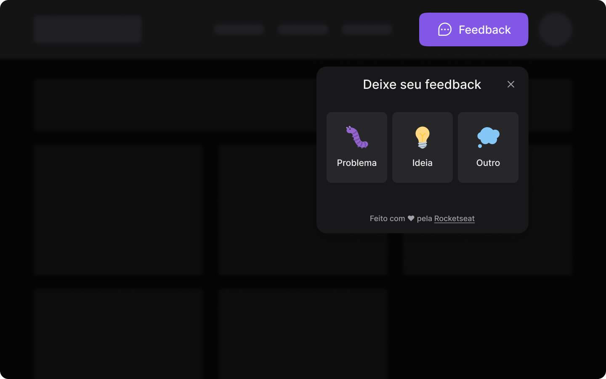

<h1 align="center">💡 Feedback Widget 💡</h1>

<p align="center">
  

  
	
  <a href="https://www.linkedin.com/in/felipe-melo-a78504186/">
    
  </a>

  <a href="https://github.com/felipefrm/nlw-heat/commits/master">
    
  </a>
</p>

<p align="center">
  <a href="#-projeto">Projeto</a>&nbsp;&nbsp;&nbsp;|&nbsp;&nbsp;&nbsp;
  <a href="#-tecnologias">Tecnologias</a>&nbsp;&nbsp;&nbsp;|&nbsp;&nbsp;&nbsp;
  <a href="#-layout">Layout</a>&nbsp;&nbsp;&nbsp;|&nbsp;&nbsp;&nbsp;
  <a href="#-to do">To Do</a>&nbsp;&nbsp;&nbsp;|&nbsp;&nbsp;&nbsp;
  <a href="#-como executar">Como executar</a>
</p>

<p align="center">
  
</p>

## 💬 Projeto

Este projeto foi desenvolvido durante o evento Next Level Week (Impulse), da Rocketseat. O mesmo teve como objetivo criar um widget de feedback completamente funcional e com foco em acessibilidade, que pode ser integrado à aplicações web e mobile, com o intuito de coletar feedbacks de usuários. Os feedbacks são enviados por email para o administrador do site/app. 

## 🧪 Tecnologias

Esse projeto foi desenvolvido com as seguintes tecnologias:

* Backend
    * [Node.js](https://nodejs.org/)
    * [Express](https://expressjs.com/pt-br/)
    * [Prisma](https://www.prisma.io/)
    * [SQLite](https://www.sqlite.org/)/[PostgreeSQL](https://www.postgresql.org/)
    * [Nodemailer](https://nodemailer.com/)
    * [Jest](https://jestjs.io/pt-BR/)

* Frontend
    * [React](https://pt-br.reactjs.org/)
    * [Vite](https://vitejs.dev/)
    * [Tailwind CSS](https://tailwindcss.com/)
    * [Headless UI](https://headlessui.dev/)
    * [html2canvas](https://html2canvas.hertzen.com/)
    * [Axios](https://axios-http.com/ptbr/)

* Mobile
    * [React Native](https://reactnative.dev/)
    * [Expo](https://expo.dev/)
    * [Axios](https://axios-http.com/ptbr/)
    * [Bottom Sheet](https://github.com/gorhom/react-native-bottom-sheet)

## 🔖 Layout

Você pode visualizar o layout do projeto através do seguinte [link](https://www.figma.com/community/file/1102912516166573468). 

Lembrando que você precisa ter uma conta no [Figma](http://figma.com/).

## ✔️ To Do

- [ ] Alterar entre tema light/dark
- [ ] Em produção, usar algum serviço de e-mail
- [ ] Melhorar corpo do e-mail
- [ ] Criar dashboard de feedbacks para o administrador
    - [ ] Autenticação (Firebase/Github OAuth)

## 🚀 Como executar

### Pré-requisitos

  - É **necessário** possuir o **[Node.js](https://nodejs.org/en/)** instalado na máquina
  - Também, é **preciso** ter um gerenciador de pacotes seja o **[NPM](https://www.npmjs.com/)** ou **[Yarn](https://yarnpkg.com/)**.
  - Por fim, para executar o app mobile é necessário ter o [Expo](expo.dev) instalado.

### Há três formar de executar a aplicação:

### 1. Executar a aplicação localmente: 

* Clone o projeto e acesse a pasta do mesmo.

```bash
$ git clone https://github.com/felipefrm/feedback-widget
$ cd feedback-widget
```

* Execute o servidor:
```bash
# Navegue para o diretório do servidor
$ cd server

# Instale as dependências
$ npm install

# Inicie o servidor
$ npm run dev
```
* Execute o front-end:
```bash
# Navegue para o diretório do servidor
$ cd web

# Instale as dependências
$ npm install

# Inicie o frontend
$ npm run dev
```

* O projeto estará disponível no seu browser pelo endereço http://localhost:3000.

### 2. Executar a aplicação hospedada na Vercel, acessando o seguinte link: <a href="feedback-widget-rust.vercel.app">feedback-widget-rust.vercel.app</a>. 

### 3. Executar a aplicação mobile:

* Certifique-se de deixar o servidor rodando, de acordo com o passo a passo explicado no item 1.

* Execute a aplicação com o Expo:

```bash
# Navegue para o diretório do app
$ cd mobile

# Instale as dependências
$ npm install

# Inicie o expo e siga as intruções passadas pelo comando
$ expo start
```
---

<p align=center>Feito por <a href="https://www.linkedin.com/in/felipefrmelo/">Felipe Melo<a> :wave:</p>